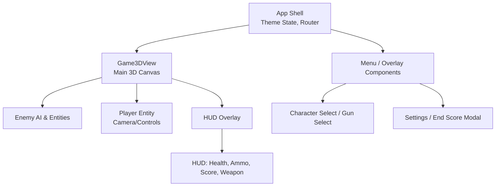
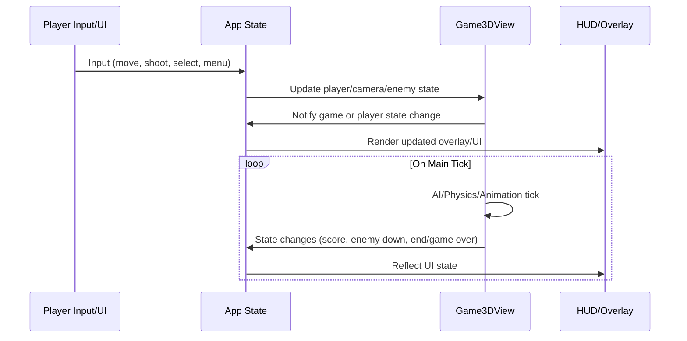

# Architecture Document
## Warzone Frontline Shooting Game (Frontend)

### 1. Introduction and Tech Stack
This project implements a highly interactive 3D FPS/TPS web game as a single-page React app. The architecture is designed for looping, real-time gameplay with responsive UI overlays, local state, and a modern aesthetic relying on custom CSS and pure React.

**Tech Stack:**
- React 18 (SPA, core components and hooks)
- Vanilla JavaScript/JSX (no external 3D/game libs in current baseline)
- CSS for theme, layout, responsive, and game-style branding
- No backend/network code
- Tooling: Create React App scripts, minimal dev dependencies

**Key Files:**
- `src/index.js` - React root and DOM anchor
- `src/App.js` - Main shell with theme handling, entry UI logic, mounts game & overlays
- `src/App.css` - CSS variables, themes, UI style foundation

### 2. Component/Module Breakdown

#### High-Level/Planned Structure

- **App (Shell/Router)**
  - Handles light/dark theme toggling
  - Determines which primary view/screen is shown
  - Mounts persistent overlays (e.g., HUD, settings, modals)

- **Game3DView**
  - Main 3D canvas for gameplay (to be implemented)
  - Handles rendering, player/AI movement, shooting, interaction

- **HUD/Overlay**
  - Renders floating UI: health, ammo, weapon, feedback
  - Layered atop 3D canvas, controlled by game state

- **Menu & Modals**
  - Start/Landing, Character Select, Gun Select, Settings, End/Score
  - Animate fade/slide in/out and manage local state
  - Reusable button and panel components

- **State Management**
  - Centralized React hooks and prop passing (no Redux)
  - Local only; state includes player, enemy, camera, inventory, audio, and UI overlays

- **Utility/Logic Modules**
  - Animation helpers
  - Enemy AI and timing logic
  - Input handling (keyboard/mouse/joystick)
  - Sound loader and trigger

---

### 3. State & Data Model (Planned)

**Player State**
- position: `{x, y, z}`
- health: `int`
- weapon: `{type, ammo, cooldown}`
- view: `FPS | TPS`
- score, killCount

**Enemy State (array)**
- position, status, AI state, respawn, etc.

**Game State**
- screen: `"menu" | "charSelect" | "gunSelect" | "playing" | "score"`
- overlay/modal states
- settings (sound volume, music, etc.)

**UI State**
- HUD info, theme

---

### 4. UI/3D Structure Diagram

---

### 5. Game Loop & Data Flow

---

### 6. Theming & Style

- Theme and color variables set via `:root` and `[data-theme="dark"]` in App.css
- Theme toggling attached to React state, changes propagated to CSS vars on document
- UI overlays use semi-transparent backgrounds for immersion and legibility

---

### Extensibility & Future Improvements

- All logic is encapsulated for extensibility (e.g., game engine module, multiplayer backend)
- Adding Three.js or Babylon.js for future 3D graphics evolution
- Modularity for future features: new modes, enemies, advanced HUD, customization

---

### 7. Development Phases/Notes

- Start with stubs for all main views and state transitions
- Implement isolated “game core” as a component, then progressively connect UI
- Maintain stateless UI overlays (HUD etc.) for simple re-use and easy testing

---

